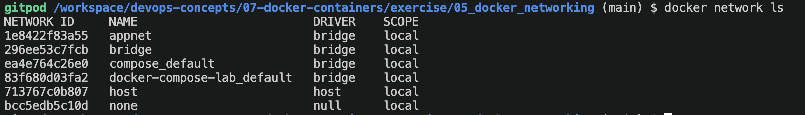
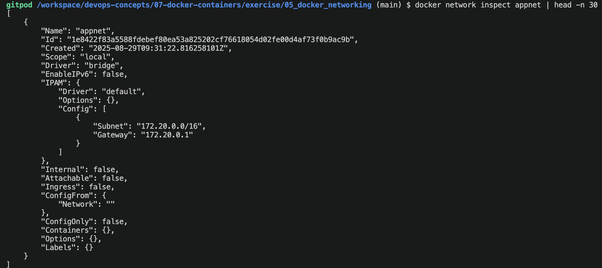
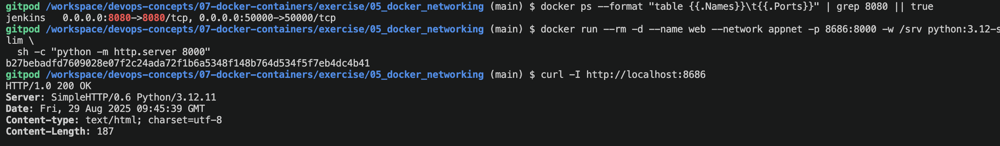

## Docker - (Networking modes: bridge vs host) - 29 August 2025


**Bridge (default)**: *Containers get their own network namespace and IP on a Docker-managed bridge. Need port mapping (e.g., -p 8080:80) to expose to host. Containers on the same user-defined bridge can reach each other by name.*


**Host**: *Container shares the host’s network namespace. No port mapping needed—services bind directly to host ports. Less isolation; careful with port conflicts and security.*


## Hands-on: Bridge mode

### 1. Create a user-defined bridge (better DNS between containers than default bridge):

```python
 docker network create appnet

 docker network ls
```
   
```python
 docker network inspect appnet | head -n 30
```
   


### 2. Run a tiny web server container on the bridge

 ```python
 # Start a simple HTTP server (python) on port 8000 inside container
docker run -d --name web --network appnet -p 8080:8000 -w /srv python:3.12-slim \
  sh -c "python -m http.server 8000"
```

### 3. Verify from host & from another container

* From host (port mapping required):

```bash
curl -I http://localhost:8080
```

* From another container on the same bridge (container DNS works):
```bash
docker run --rm --network appnet curlimages/curl:8.7.1 -I http://web:8000
```
Expected: Both return HTTP/1.0 200 OK (or similar).

Notice: On bridge, you needed -p 8080:8000 to reach it from host; other containers on appnet can use http://web:8000 by name.


### 4. Hands-on: Host mode (15 min)

1. Run the server in host mode (no port mapping):

```python
docker run --rm --name webhost --network host -w /srv python:3.12-slim \
  sh -c "python -m http.server 8000"
```
2. Verify from host (no -p used):

```bash
curl -I http://localhost:8000
```
Expected: Works because the container is binding directly on the host’s network stack.

3. Key observations to note:

* **No -p needed in host mode**; *ports collide with host if already in use.*

* **Isolation trade-off**: *host mode exposes services directly; fewer layers, potentially lower latency, but weaker isolation and risk of conflicts.*


 ### Troubleshooting

 1. Port is already allocated & container name is already in use by container

 ```
 gitpod /workspace/devops-concepts/07-docker-containers/exercise/05_docker_networking (main) $ docker run -d --name web --network appnet -p 8080:8000 -w /srv python:3.12-slim \ 
  sh -c "python -m http.server 8000"
11a6dc8a286e0e425d18415b0e358855020793270be0d9c79144e54a030cb8d5
docker: Error response from daemon: driver failed programming external connectivity on endpoint web (827bf990ef82788f7d94e1550d5b856ad32cd7bf4d1f5d793111803a9d5a0709): Bind for 0.0.0.0:8080 failed: port is already allocated.
```
```
gitpod /workspace/devops-concepts/07-docker-containers/exercise/05_docker_networking (main) $ docker run -d --name web --network appnet -p 8686:8000 -w /srv python:3.12-slim  
 sh -c "python -m http.server 8000"
docker: Error response from daemon: Conflict. The container name "/web" is already in use by container "11a6dc8a286e0e425d18415b0e358855020793270be0d9c79144e54a030cb8d5". You have to remove (or rename) that container to be able to reuse that name.
See 'docker run --help'.
```

### Solution

```python
# 1) See which containers are using ports (esp. 8080)
docker ps --format "table {{.Names}}\t{{.Status}}\t{{.Ports}}"

# 2) If a container named 'web' exists (running or exited), remove it to free the name
docker ps -a --format "table {{.Names}}\t{{.Status}}" | grep -w web || true
docker rm -f web 2>/dev/null || true

# (Optional) If something else is on 8080, either stop it or just pick another port.
# To find any container exposing 8080:
docker ps --format "table {{.Names}}\t{{.Ports}}" | grep 8080 || true
```

Re-run safely (choose ONE):

A. Use a different host port (e.g., 8686):

```python
docker run --rm -d --name web --network appnet -p 8686:8000 -w /srv python:3.12-slim \
  sh -c "python -m http.server 8000"

# verify from host:
curl -I http://localhost:8686
```



B. Let Docker pick a free random port automatically:

```python
docker run --rm -d --name web --network appnet -p 0:8000 -w /srv python:3.12-slim \
  sh -c "python -m http.server 8000"

# discover which host port got assigned:
docker port web 8000
# example output: 0.0.0.0:32775  -> then
curl -I http://localhost:32775
```
